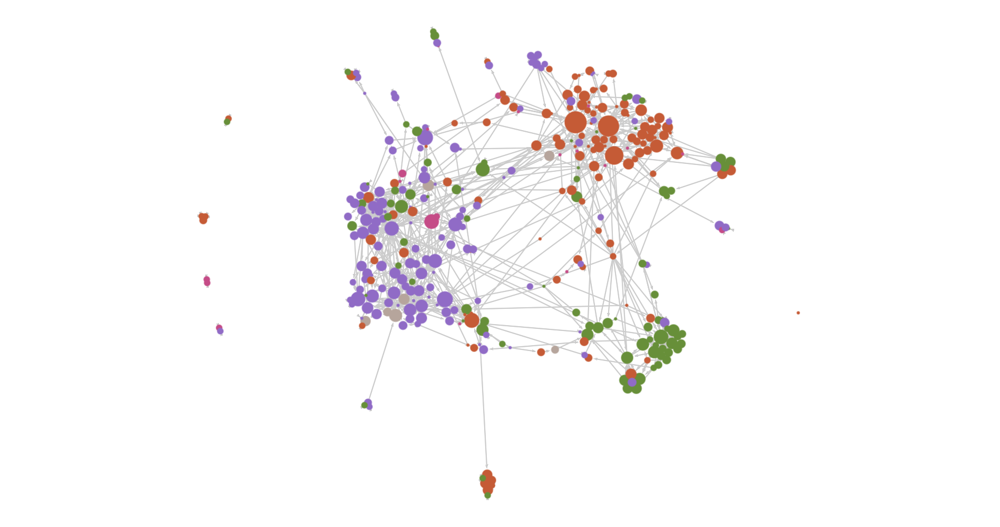
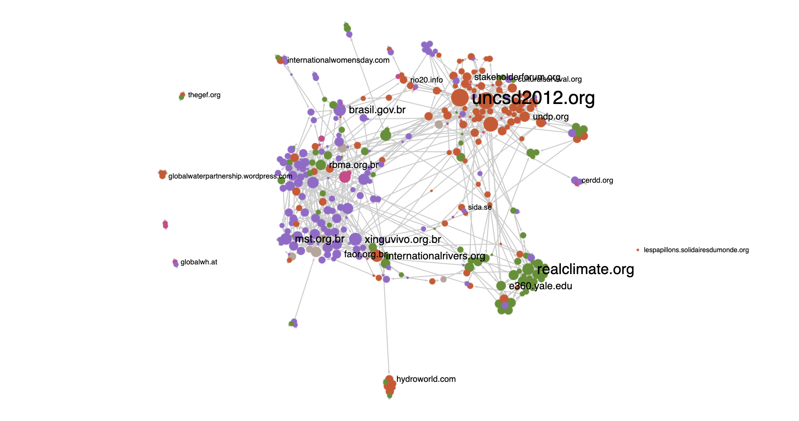
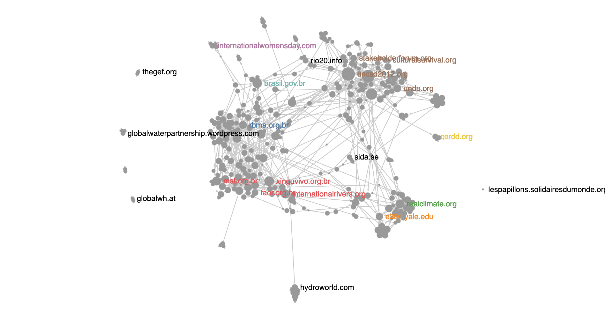
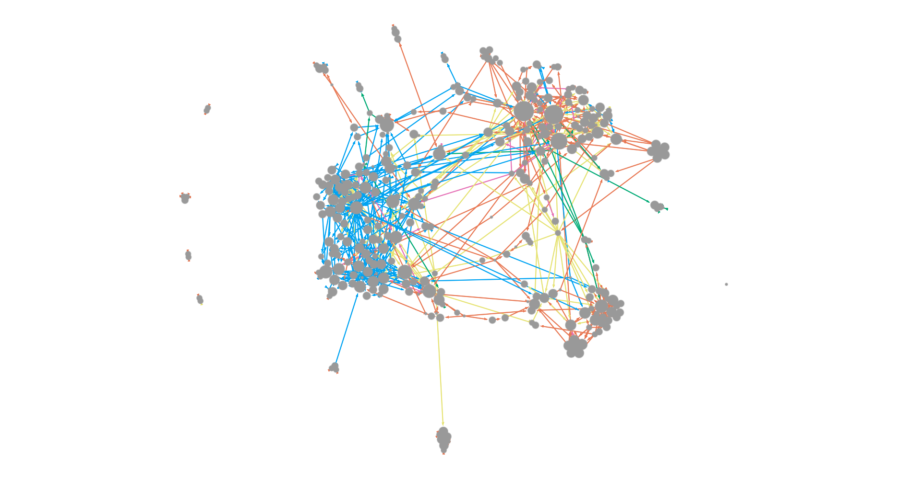
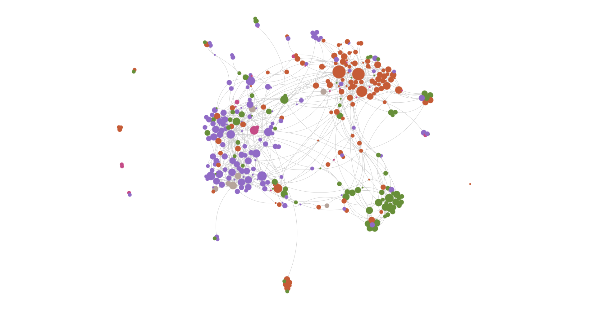

# ipysigma

A [Jupyter](https://jupyter.org/) widget using [sigma.js](https://www.sigmajs.org/) and [graphology](https://graphology.github.io/) to render interactive networks directly within the result of a notebook cell.

`ipysigma` has been designed to work with either [`networkx`](https://networkx.org/) or [`igraph`](https://igraph.readthedocs.io).

<p align="center">
  
</p>

## Summary

- [Installation](#installation)
- [Quick start](#quick-start)
- [Examples](#examples)
- [Available visual variables](#available-visual-variables)
  - [node_color](#node_color)
  - [node_color_saturation](#node_color_saturation)
  - [node_size](#node_size)
  - [node_label](#node_label)
  - [node_label_size](#node_label_size)
  - [node_label_color](#node_label_color)
  - [node_border_size](#node_border_size)
  - [node_border_ratio](#node_border_ratio)
  - [node_border_color](#node_border_color)
  - [node_pictogram](#node_pictogram)
  - [node_pictogram_color](#node_pictogram_color)
  - [node_shape](#node_shape)
  - [node_halo_size](#node_halo_size)
  - [node_halo_color](#node_halo_color)
  - [edge_color](#edge_color)
  - [edge_type](#edge_type)
  - [edge_size](#edge_size)
  - [edge_curveness](#edge_curveness)
  - [edge_label](#edge_label)
- [What data can be used as visual variable](#what-data-can-be-used-as-visual-variable)
- [Visual variables and kwarg naming rationale](#visual-variables-and-kwarg-naming-rationale)
- [Scales, palettes and gradients](#scales-palettes-and-gradients)
- [Frequently asked questions](#frequently-asked-questions)
- [API Reference](#api-reference)
  - [Sigma](#sigma)
    - [#.get_layout](#get_layout)
    - [#.get_camera_state](#get_camera_state)
    - [#.get_selected_node](#get_selected_node)
    - [#.get_selected_edge](#get_selected_edge)
    - [#.get_selected_node_category_values](#get_selected_node_category_values)
    - [#.get_selected_edge_category_values](#get_selected_edge_category_values)
    - [#.render_snapshot](#render_snapshot)
    - [#.to_html](#to_html)
    - [Sigma.write_html](#sigmawrite_html)
  - [SigmaGrid](#sigmagrid)
    - [#.add](#add)
- [Using in Google Colab](#using-in-google-colab)

## Installation

You can install using `pip`:

```bash
pip install ipysigma
```

You will also need to install either `networkx` or `igraph` of course.

If you are using an older version of Jupyter, you might also need to enable the nbextension likewise:

```bash
jupyter nbextension enable --py --sys-prefix ipysigma

# You might need one of those other commands
jupyter nbextension enable --py --user ipysigma
jupyter nbextension enable --py --system ipysigma
```

## Quick start

*Using networkx*

```python
import networkx as nx
from ipysigma import Sigma

# Importing a gexf graph
g = nx.read_gexf('./my-graph.gexf')

# Displaying the graph with a size mapped on degree and
# a color mapped on a categorical attribute of the nodes
Sigma(g, node_size=g.degree, node_color='category')
```

*Using igraph*

```python
import igraph as ig
from ipysigma import Sigma

# Generating a graph
g = ig.Graph.Famous('Zachary')

# Displaying the graph with a size mapped on degree and
# a color mapped on node betweenness centrality, using
# a continuous color scale named "Viridis"
Sigma(g, node_size=g.degree, node_color=g.betweenness(), node_color_gradient='Viridis')
```

## Examples

*Letting the widget compute a Louvain partition and using it as node colors*

```python
Sigma(g, node_metrics=['louvain'], node_color='louvain')
```

*Functional testing notebooks*

If you want comprehensive examples of the widget's visual variables being used, you can read the notebooks found [here](./notebooks/Tests/), which serve as functional tests to the library.

## Available visual variables

### node_color



### node_color_saturation


### node_size


### node_label


### node_label_size



### node_label_color



### node_border_size


### node_border_ratio


### node_border_color


### node_pictogram


### node_pictogram_color


### node_shape


### node_halo_size


### node_halo_color


### edge_color



### edge_type



### edge_size


### edge_curveness


### edge_label


## What data can be used as visual variable

TODO...

## Visual variables and kwarg naming rationale

TODO...

## Scales, palettes and gradients

TODO...

## Frequently asked questions

*How can I display more labels?*

TODO...

## API Reference

### Sigma

*Arguments*

%(sigma_args)s

#### #.get_layout

Method returning the layout of the graph, i.e. the current node positions in the widget, as a dict mapping nodes to their `{x, y}` coordinates.

#### #.get_camera_state

Method returning the current camera state of the widget, as a `{x, y, ratio, angle}` dict.

#### #.get_selected_node

Method returning the currently selected node if any or `None`.

#### #.get_selected_edge

Method returning the currently selected edge as a `(source, target)` tuple if any or `None`.

#### #.get_selected_node_category_values

Method returning a set of currently selected node category values or `None`.

#### #.get_selected_edge_category_values

Method returning a set of currently selected edge category values or `None`.

#### #.render_snapshot

Method rendering the widget as an rasterized image in the resulting cell.

#### #.to_html

Method rendering the widget as a standalone HTML file that can be hosted statically elsewhere.

*Arguments*

* **path** *PathLike or file*: where to save the HTML file.

#### Sigma.write_html

Static method taking the same kwargs as [`Sigma`](#sigma) and rendering the widget as a standalone HTML file that can be hosted statically elsewhere.

*Arguments*

* **graph** *nx.AnyGraph or ig.AnyGraph*: graph to represent.
* **path** *PathLike or file*: where to save the HTML file.
* **fullscreen** *bool, optional* [`False`]: whether to display the widget by taking up the full space of the screen. If `False`, will follow the given `height`.
* ****kwarg**: any kwarg accepted by [`Sigma`](#sigma).

### SigmaGrid

*Arguments*

%(sigma_grid_args)s

#### #.add

Method one can use as an alternative or combined to `SigmaGrid` constructor's `views` kwarg to add a new `Sigma` view to the grid. It takes any argument taken by [`Sigma`](#sigma) and returns self for easy chaining.

```python
SigmaGrid(g, node_color='category').add(node_size=g.degree).add(node_size='occurrences')
```

## Using in Google Colab

If you want to be able to use `ipysigma` on [Google Colab](https://colab.research.google.com), you will need to enable widget output using the following code:

```python
from google.colab import output

output.enable_custom_widget_manager()
```

Remember you can always install packages in Colab by executing the following command in a cell:

```
!pip install networkx ipysigma
```
